1. Створіть базу даних для керування бібліотекою книг згідно зі структурою, наведеною нижче. Використовуйте DDL-команди для створення необхідних таблиць та їх зв'язків.

**Рішення**

``` sql
CREATE DATABASE LibraryManagement;

USE LibraryManagement;

CREATE TABLE authors (
    author_id INT AUTO_INCREMENT PRIMARY KEY,
    author_name VARCHAR(255) NOT NULL
);

CREATE TABLE genres (
    genre_id INT AUTO_INCREMENT PRIMARY KEY,
    genre_name VARCHAR(255) NOT NULL
);

CREATE TABLE books (
    book_id INT AUTO_INCREMENT PRIMARY KEY,
    title VARCHAR(255) NOT NULL,
    publication_year YEAR NOT NULL,
    author_id INT,
    genre_id INT,
    FOREIGN KEY (author_id) REFERENCES authors(author_id),
    FOREIGN KEY (genre_id) REFERENCES genres(genre_id)
);

CREATE TABLE users (
    user_id INT AUTO_INCREMENT PRIMARY KEY,
    username VARCHAR(255) NOT NULL,
    email VARCHAR(255) NOT NULL
);

CREATE TABLE borrowed_books (
    borrow_id INT AUTO_INCREMENT PRIMARY KEY,
    book_id INT,
    user_id INT,
    borrow_date DATE NOT NULL,
    return_date DATE,
    FOREIGN KEY (book_id) REFERENCES books(book_id),
    FOREIGN KEY (user_id) REFERENCES users(user_id)
);
```

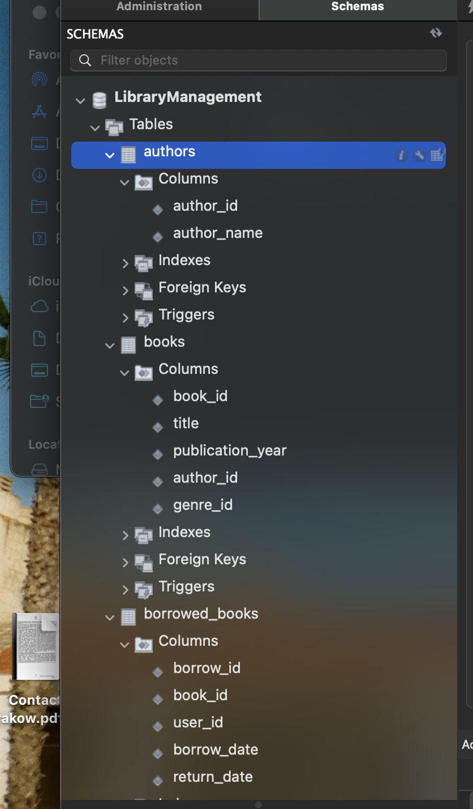

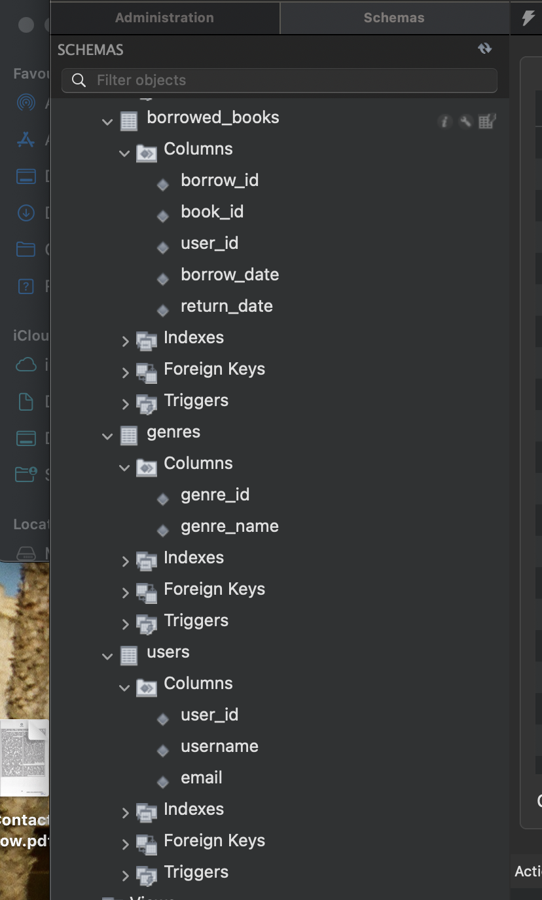


2. Заповніть таблиці простими видуманими тестовими даними. Достатньо одного-двох рядків у кожну таблицю.

**Рішення**
``` sql
INSERT INTO authors (author_name) VALUES 
('George Orwell'),
('J.K. Rowling'),
('F. Scott Fitzgerald'),
('Emily Henry');  

INSERT INTO genres (genre_name) VALUES 
('Dystopian'),
('Fantasy'),
('Classic Literature'),
('Romance');

INSERT INTO books (title, publication_year, author_id, genre_id) VALUES 
('1984', 1949, 1, 1),  
('Harry Potter and the Philosophers Stone', 1997, 2, 2),  
('The Great Gatsby', 1925, 3, 3),  
('Book Lovers', 2022, 4, 4);

INSERT INTO users (username, email) VALUES 
('john_doe', 'john.doe@example.com'),
('jane_smith', 'jane.smith@example.com');

INSERT INTO borrowed_books (book_id, user_id, borrow_date, return_date) VALUES 
(1, 1, '2024-01-01', '2024-01-15'), 
(2, 2, '2024-01-05', '2024-01-20'); 
```

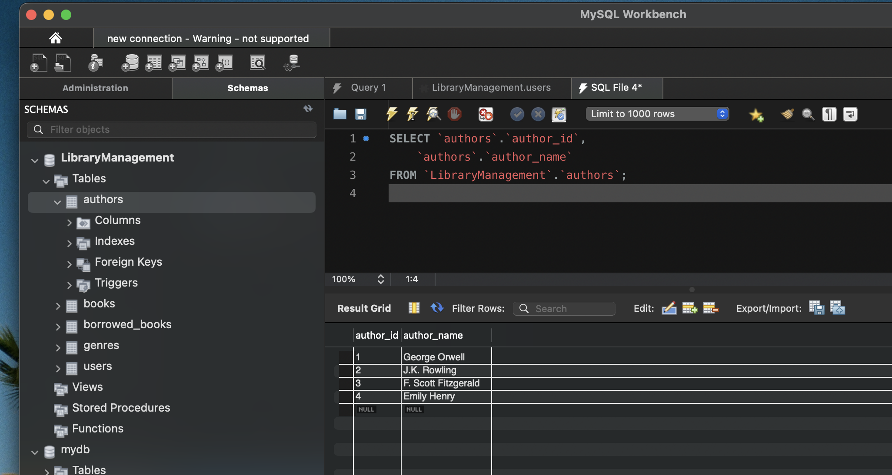

3. Перейдіть до бази даних, з якою працювали у темі 3. Напишіть запит за допомогою операторів FROM та INNER JOIN, що об’єднує всі таблиці даних, які ми завантажили з файлів: order_details, orders, customers, products, categories, employees, shippers, suppliers

**Рішення**
``` sql
USE new_table;

SELECT * FROM orders;
SELECT * FROM customers;
 

 SELECT * FROM orders o
 INNER JOIN customers cs ON o.customer_id = cs.id
 INNER JOIN employees em ON o.employee_id = em.employee_id
 INNER JOIN shippers sh ON o.shipper_id = sh.id
 INNER JOIN order_details od ON o.id = od.order_id
 INNER JOIN products pr ON od.product_id = pr.id
 INNER JOIN categories cat ON pr.category_id = cat.id
 INNER JOIN suppliers su ON pr.supplier_id = su.id
 ```

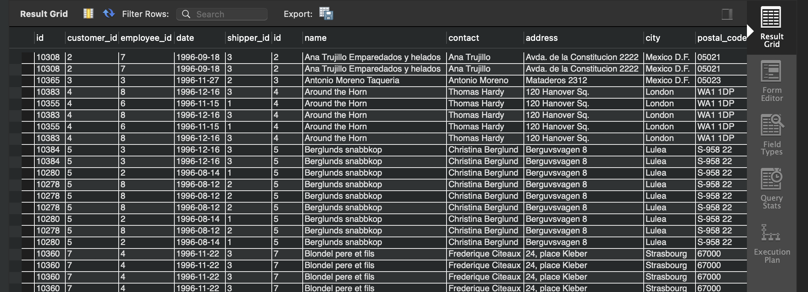
 4. 

**Рішення**

1) Визначте, скільки рядків ви отримали (за допомогою оператора COUNT).

518 

``` sql
 USE new_table;

SELECT * FROM orders;
SELECT * FROM customers;
 

 SELECT COUNT(*)
 FROM orders o
 INNER JOIN customers cs ON o.customer_id = cs.id
 INNER JOIN employees em ON o.employee_id = em.employee_id
 INNER JOIN shippers sh ON o.shipper_id = sh.id
 INNER JOIN order_details od ON o.id = od.order_id
 INNER JOIN products pr ON od.product_id = pr.id
 INNER JOIN categories cat ON pr.category_id = cat.id
 INNER JOIN suppliers su ON pr.supplier_id = su.id
  ```

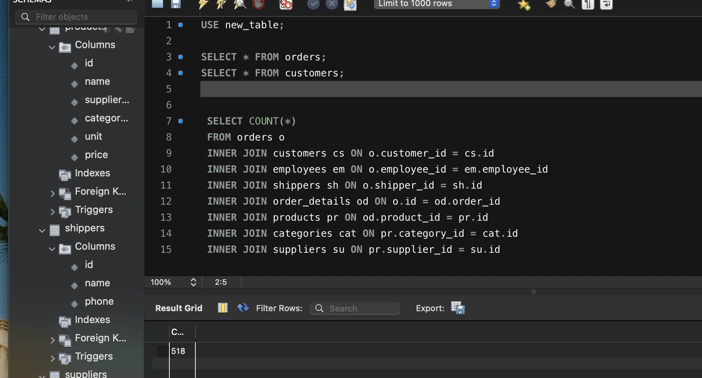

  2) Змініть декілька операторів INNER на LEFT чи RIGHT. Визначте, що відбувається з кількістю рядків. Чому? Напишіть відповідь у текстовому файлі.

  **INNER JOIN**: Повертає тільки ті рядки, які мають відповідні записи в обох таблицях. Якщо в таблицях немає спільних рядків за умовами з'єднання, ці рядки не потрапляють у результат.
**LEFT JOIN**: Повертає всі рядки з лівої таблиці та відповідні рядки з правої, включаючи NULL для відсутніх значень з правої таблиці.
**RIGHT JOIN**: Повертає всі рядки з правої таблиці та відповідні рядки з лівої, включаючи NULL для відсутніх значень з лівої таблиці.

Але в результаті експерименту кількість рядків не змінилась.

``` sql
USE new_table;

SELECT * FROM orders;
SELECT * FROM customers;
 

 SELECT COUNT(*)
 FROM orders o
 RIGHT JOIN customers cs ON o.customer_id = cs.id
 LEFT JOIN employees em ON o.employee_id = em.employee_id
 RIGHT JOIN shippers sh ON o.shipper_id = sh.id
 LEFT JOIN order_details od ON o.id = od.order_id
 RIGHT JOIN products pr ON od.product_id = pr.id
 RIGHT JOIN categories cat ON pr.category_id = cat.id
 RIGHT JOIN suppliers su ON pr.supplier_id = su.id
   ```

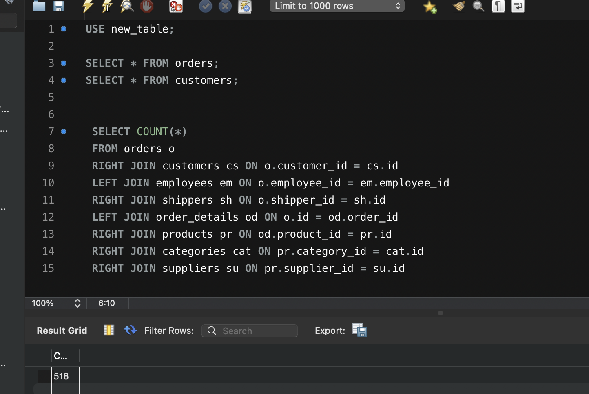

   3) Оберіть тільки ті рядки, де employee_id > 3 та ≤ 10.
   
``` sql
   USE new_table;

SELECT * FROM orders;
SELECT * FROM customers;
 

 SELECT * FROM orders o
 INNER JOIN customers cs ON o.customer_id = cs.id
 INNER JOIN employees em ON o.employee_id = em.employee_id
 INNER JOIN shippers sh ON o.shipper_id = sh.id
 INNER JOIN order_details od ON o.id = od.order_id
 INNER JOIN products pr ON od.product_id = pr.id
 INNER JOIN categories cat ON pr.category_id = cat.id
 INNER JOIN suppliers su ON pr.supplier_id = su.id
 WHERE  em.employee_id > 3 AND  em.employee_id <= 10
 ```

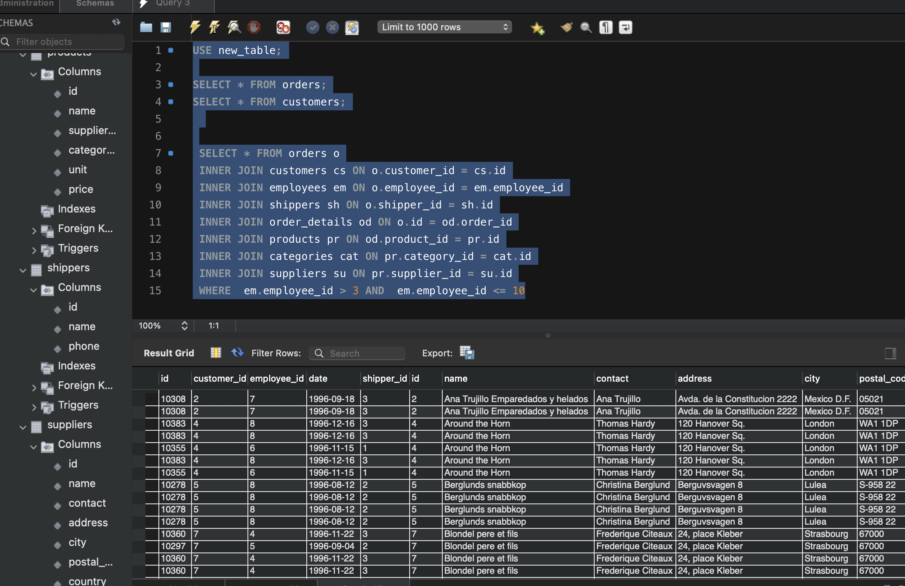
  4) Згрупуйте за іменем категорії, порахуйте кількість рядків у групі, середню кількість товару (кількість товару знаходиться в order_details.quantity)

``` sql
  USE new_table;

SELECT * FROM orders;
SELECT * FROM customers;
 
 SELECT cat.name, COUNT(*), AVG(od.quantity)
 FROM orders o
 INNER JOIN customers cs ON o.customer_id = cs.id
 INNER JOIN employees em ON o.employee_id = em.employee_id
 INNER JOIN shippers sh ON o.shipper_id = sh.id
 INNER JOIN order_details od ON o.id = od.order_id
 INNER JOIN products pr ON od.product_id = pr.id
 INNER JOIN categories cat ON pr.category_id = cat.id
 INNER JOIN suppliers su ON pr.supplier_id = su.id
 WHERE  em.employee_id > 3 AND  em.employee_id <= 10
 GROUP BY cat.name
 ```
 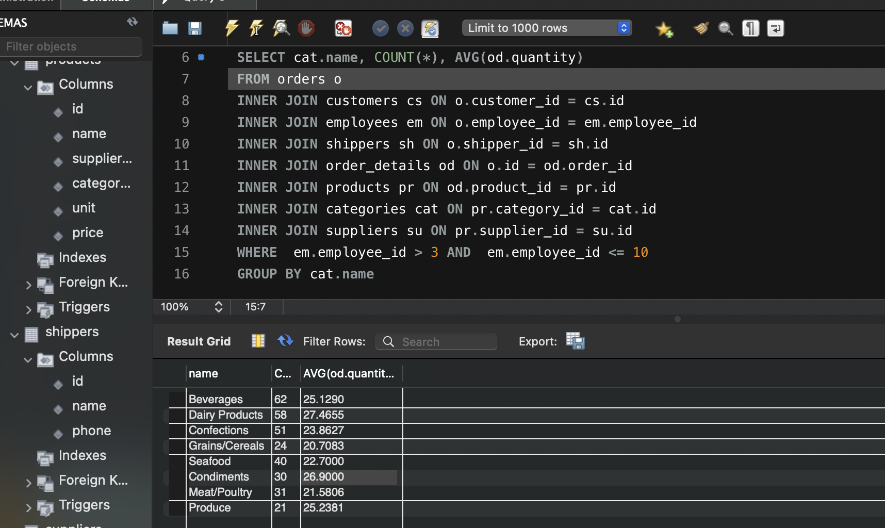

  5) Відфільтруйте рядки, де середня кількість товару більша за 21.

``` sql
  USE new_table;

SELECT * FROM orders;
SELECT * FROM customers;
 
 SELECT cat.name, COUNT(*), AVG(od.quantity)
 FROM orders o
 INNER JOIN customers cs ON o.customer_id = cs.id
 INNER JOIN employees em ON o.employee_id = em.employee_id
 INNER JOIN shippers sh ON o.shipper_id = sh.id
 INNER JOIN order_details od ON o.id = od.order_id
 INNER JOIN products pr ON od.product_id = pr.id
 INNER JOIN categories cat ON pr.category_id = cat.id
 INNER JOIN suppliers su ON pr.supplier_id = su.id
 WHERE  em.employee_id > 3 AND  em.employee_id <= 10
 GROUP BY cat.name
 HAVING AVG(od.quantity) > 21
 ```
 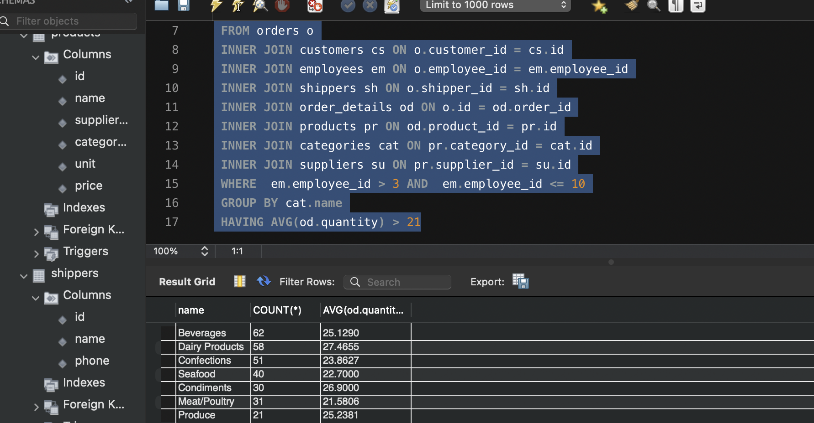

  6) Відсортуйте рядки за спаданням кількості рядків.

    ``` sql
    USE new_table;

    SELECT * FROM orders;
    SELECT * FROM customers;
    
    SELECT cat.name, COUNT(*), AVG(od.quantity)
    FROM orders o
    INNER JOIN customers cs ON o.customer_id = cs.id
    INNER JOIN employees em ON o.employee_id = em.employee_id
    INNER JOIN shippers sh ON o.shipper_id = sh.id
    INNER JOIN order_details od ON o.id = od.order_id
    INNER JOIN products pr ON od.product_id = pr.id
    INNER JOIN categories cat ON pr.category_id = cat.id
    INNER JOIN suppliers su ON pr.supplier_id = su.id
    WHERE  em.employee_id > 3 AND  em.employee_id <= 10
    GROUP BY cat.name
    HAVING AVG(od.quantity) > 21
    ORDER BY COUNT(*) DESC
  ```

  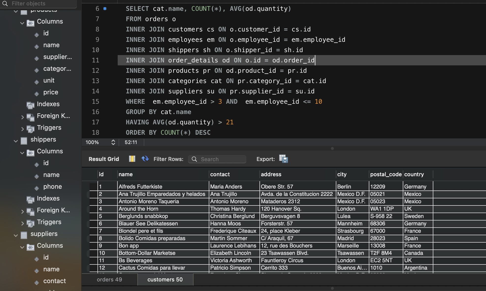

  7) Виведіть на екран (оберіть) чотири рядки з пропущеним першим рядком.

    ``` sql
   USE new_table;

  SELECT * FROM orders;
  SELECT * FROM customers;
  
  SELECT cat.name, COUNT(*), AVG(od.quantity)
  FROM orders o
  INNER JOIN customers cs ON o.customer_id = cs.id
  INNER JOIN employees em ON o.employee_id = em.employee_id
  INNER JOIN shippers sh ON o.shipper_id = sh.id
  INNER JOIN order_details od ON o.id = od.order_id
  INNER JOIN products pr ON od.product_id = pr.id
  INNER JOIN categories cat ON pr.category_id = cat.id
  INNER JOIN suppliers su ON pr.supplier_id = su.id
  WHERE  em.employee_id > 3 AND  em.employee_id <= 10
  GROUP BY cat.name
  HAVING AVG(od.quantity) > 21
  ORDER BY COUNT(*) DESC
  LIMIT 4 OFFSET 1
    ```

    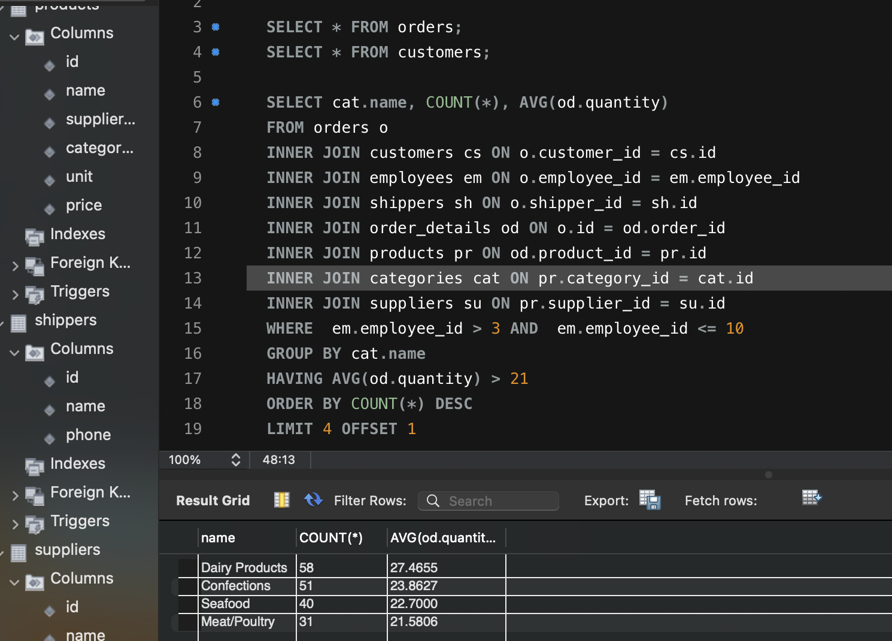